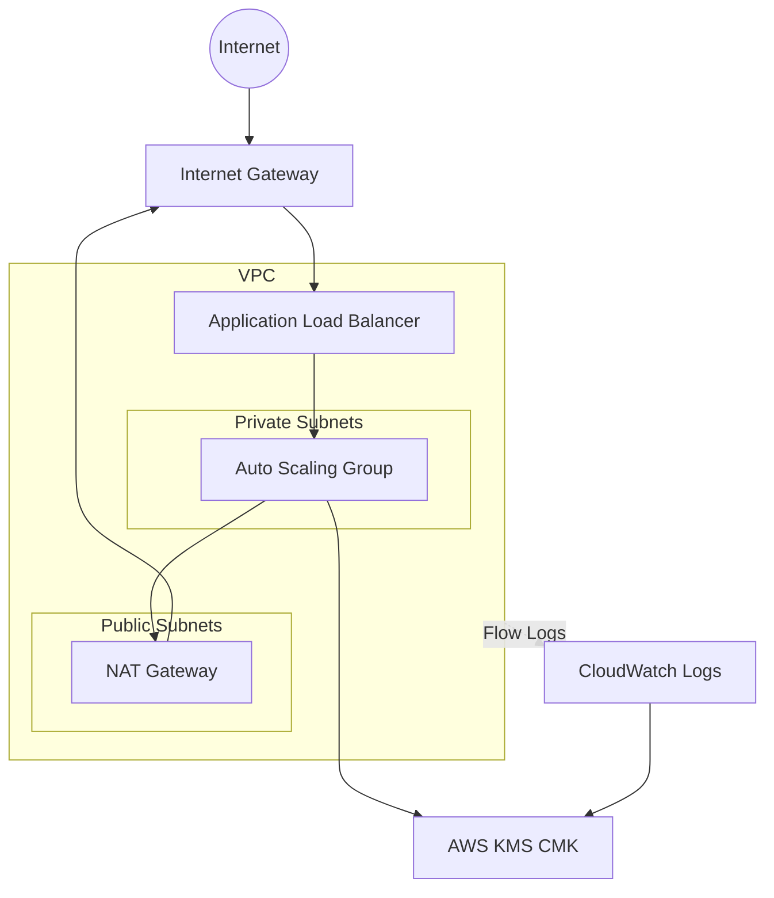

# terraform-aws-enterprise-foundation

Enterprise-grade AWS infrastructure foundation module using Terraform. This module provisions a fully featured, secure, and automated architecture incorporating:
- **Networking:** Multi-AZ VPC with Public and Private Subnets, NAT Gateways for outbound private traffic.
- **Compute:** Auto Scaling Group with a secure Launch Template (IMDSv2) behind an Application Load Balancer.
- **Security & Compliance:** Customer Managed KMS Keys (CMK) encrypting EBS root volumes and CloudWatch VPC Flow Logs.
- **IAM:** Instance Profiles and Security Groups following the principle of least privilege.
- **DevSecOps:** Fully automated CI/CD validation via GitHub Actions (tflint, tfsec, terraform validate) and local pre-commit hooks.

## Architecture Overview



## Usage

See the `examples/complete` directory for a fully working example.

```hcl
module "foundation" {
  source = "./"

  environment        = "prod"
  project_name       = "my-enterprise-app"
  vpc_cidr           = "10.0.0.0/16"
  public_subnets     = ["10.0.1.0/24", "10.0.2.0/24"]
  private_subnets    = ["10.0.10.0/24", "10.0.20.0/24"]
  availability_zones = ["us-east-1a", "us-east-1b"]
  instance_type      = "t3.micro"
  min_size           = 2
  max_size           = 4

  tags = {
    Owner       = "platform-team"
    CostCenter  = "12345"
  }
}
```

## Requirements

| Name | Version |
|------|---------|
| terraform | >= 1.3.0 |
| aws | >= 4.60.0 |
