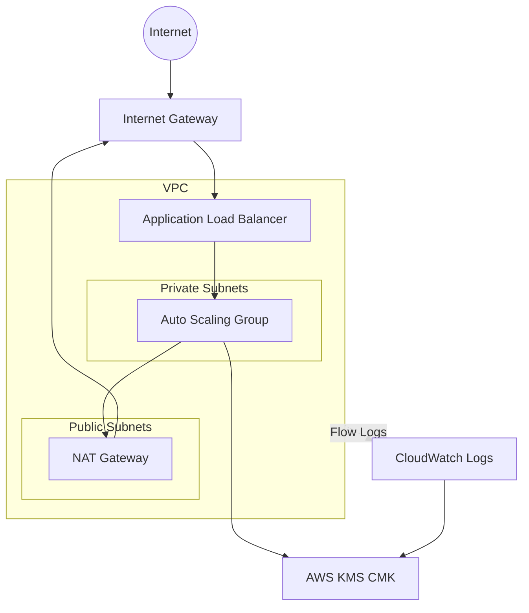

# terraform-aws-enterprise-foundation

[](https://github.com/theatulmishra/terraform-aws-enterprise-foundation/actions)
[](https://github.com/theatulmishra/terraform-aws-enterprise-foundation/releases)
[](https://www.terraform.io/)
[](LICENSE)

An enterprise-grade AWS infrastructure foundation Terraform module. This module provisions a fully featured, secure, and highly available architecture incorporating best-practice networking, secure computing tiers, identity control, and comprehensive monitoring.

## Key Features

*   🌐 **High-Availability Networking:** Multi-AZ VPC with Public and Private Subnets, NAT Gateways for secure private-subnet internet egress, and route table associations.
*   💻 **Auto-Scaling Compute:** Auto Scaling Group (ASG) utilizing instance launch templates configured with IMDSv2 (Session Tokens Required) for defense-in-depth security.
*   ⚖️ **Load Balancing:** Application Load Balancer (ALB) acting as a front-end router to automatically balance traffic across instances in private subnets.
*   🔒 **Security & Compliance:** 
    *   Customer Managed Key (KMS CMK) encrypting EBS root volumes and logs.
    *   CloudWatch Log Group integration for VPC Flow Logs.
    *   Security Groups following the principle of least privilege.
*   🤖 **DevSecOps Ready:** Pre-configured local Git hooks via `pre-commit`, TFLint validation rulesets, and GitHub Actions CI pipelines running validation, linting, and Trivy security scanning.

---

## Architecture Overview



---

## Quick Start & Usage

### 1. Consume the Module (Version Pinned)

Declare the module in your code configuration, pinning it to the release version (e.g. `v1.0.0`):

```hcl
data "aws_availability_zones" "available" {
  state = "available"
}

module "foundation" {
  source = "git::https://github.com/theatulmishra/terraform-aws-enterprise-foundation.git?ref=v1.0.0"

  environment        = "prod"
  project_name       = "my-enterprise-app"
  vpc_cidr           = "10.0.0.0/16"
  public_subnets     = ["10.0.1.0/24", "10.0.2.0/24"]
  private_subnets    = ["10.0.10.0/24", "10.0.20.0/24"]
  availability_zones = slice(data.aws_availability_zones.available.names, 0, 2)
  instance_type      = "t3.micro"
  min_size           = 2
  max_size           = 4

  tags = {
    Owner       = "platform-team"
    CostCenter  = "12345"
  }
}
```

### 2. Configure Remote State (Bootstrap Backend)

Before deploying your resources, bootstrap the secure remote state backend (S3 bucket for state files and DynamoDB for state locking):

1. Navigate to the bootstrap utility:
   ```bash
   cd bootstrap
   ```
2. Initialize and apply:
   ```bash
   terraform init
   ```
   ```bash
   terraform apply
   ```
3. Use the generated output configuration snippet to establish the backend in your main configurations (e.g., `backend.tf`):
   ```hcl
   terraform {
     backend "s3" {
       bucket         = "<OUTPUT_STATE_BUCKET_NAME>"
       key            = "state/terraform.tfstate"
       region         = "us-east-1"
       dynamodb_table = "<OUTPUT_LOCKS_TABLE_NAME>"
       encrypt        = true
       kms_key_id     = "<OUTPUT_KMS_KEY_ARN>"
     }
   }
   ```

---

## Inputs

| Name | Description | Type | Default | Required |
|------|-------------|------|---------|:--------:|
| `environment` | Environment name (e.g. `dev`, `stage`, `prod`). | `string` | n/a | **yes** |
| `project_name` | Name of the project. | `string` | n/a | **yes** |
| `availability_zones` | List of Availability Zones to deploy subnets in. | `list(string)` | n/a | **yes** |
| `vpc_cidr` | CIDR block for the VPC. | `string` | `"10.0.0.0/16"` | no |
| `public_subnets` | List of public subnet CIDR blocks. | `list(string)` | `["10.0.1.0/24", "10.0.2.0/24"]` | no |
| `private_subnets` | List of private subnet CIDR blocks. | `list(string)` | `["10.0.10.0/24", "10.0.20.0/24"]` | no |
| `instance_type` | EC2 instance type for ASG compute nodes. | `string` | `"t3.micro"` | no |
| `min_size` | Minimum size of the Auto Scaling Group. | `number` | `1` | no |
| `max_size` | Maximum size of the Auto Scaling Group. | `number` | `3` | no |
| `tags` | Additional tags to apply to all resources. | `map(string)` | `{}` | no |

## Outputs

| Name | Description |
|------|-------------|
| `vpc_id` | The ID of the provisioned VPC. |
| `public_subnet_ids` | List of public subnet resource IDs. |
| `private_subnet_ids` | List of private subnet resource IDs. |
| `alb_dns_name` | Public DNS name of the Application Load Balancer. |
| `asg_name` | Name of the Auto Scaling Group. |

---

## Developer Guide & Code Quality

To maintain clean, robust, and secure configuration files:

### Local Validation Checkers

1.  **Format Check:**
    ```bash
    terraform fmt -recursive
    ```
2.  **Syntax Verification:**
    ```bash
    terraform validate
    ```
3.  **TFLint:**
    Initialize plugins and run the AWS lint rules:
    ```bash
    tflint --init
    tflint
    ```

### Pre-commit Hooks

This project is set up with pre-commit configurations to validate files before staging commits.
1. Install pre-commit:
   ```bash
   pip install pre-commit
   ```
2. Activate local git hooks:
   ```bash
   pre-commit install
   ```

### CI/CD Pipelines

Our workflows are automated via GitHub Actions on every Pull Request to `main`. The pipeline runs:
- Terraform formatting check.
- TFLint validating static analysis and AWS resource policies.
- Terraform syntax validation.
- **Trivy Scanner** checks for security vulnerabilities and compliance gaps in configurations.

---

## License

This repository is licensed under the MIT License. See [LICENSE](LICENSE) for details.
